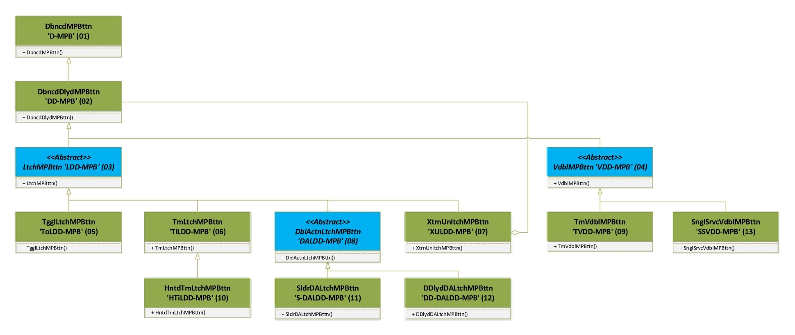

# Buttons to Switches Library (ButtonToSwitch)
## The driving concept is pretty simple:
# - _Stop checking the input pin voltage._  
# - _Start asking if the switch is On or Off._  

# [Complete Library Documentation Click Here!](https://gabygold67.github.io/ButtonToSwitch_AVR/)  

This Arduino library is a refactoring of my own **ButtonToSwitch_STM32 (RTOS)** and **ButtonToSwitch_ESP32 (RTOS-Arduino)** libraries. For making this possible this library depends on the [TimerOne library](https://github.com/PaulStoffregen/TimerOne) supporting every platform compatible with that library. Several forks of the library exist to support different architectures, including ESP32 boards, Arduino Uno-R4, and others.

---

## An Arduino library that builds switch mechanisms replacements out of simple push buttons.  
By using just a push button (a.k.a. momentary switches or momentary buttons, _**MPB**_ for short from here on) the classes implemented in this library will manage, calculate and update different parameters to **generate the behavior of standard electromechanical switches**. Those parameters include presses, releases, timings, counters or secondary input readings as needed.

The instantiated switch state is calculated independently by the use of the timer, that keeps the state of the objects created constantly updated including the ON/OFF condition, without constant polling needed. The timer setup is managed by in-class methods, including the possibility to pause, resume or end the timer of each object independently of the others.  
Each class offers a wide range of methods to set, read and modify every significant aspect of each switch mechanism simulated, and the signal received from the push button is debounced for a correct behavior of the event processing.  

## The library implements the following switches mechanisms:    
* **Debounced Momentary Push Button** (a.k.a. Momentary switch, a.k.a. **Pushbutton**)  
* **Debounced Delayed Momentary Push Button** (a.k.a. **Delayed Pushbutton**)  
* **Toggle Switch Momentary Push Button** (a.k.a. Alternate Pushbutton, a.k.a. **Latched Switch**)  
* **Timer Toggled Momentary Push Button** (a.k.a. **Timer Switch**)  
* **Hinted Timer Toggled** (a.k.a. **Staircase Timer Switch**)
* **External Unlatch Toggle** (a.k.a. **Emergency Latched Switch**)
* **Time Voidable Momentary Push Button**  (a.k.a. **Anti-Tampering Switch**)
* **Single Service Voidable Momentary Push Button**  (a.k.a. **Trigger Switch**) 
* **Short Press/Long Press Double action On/Off + Slider combo switch**  (a.k.a. **Off/On/Dimmer**, a.k.a. **Off/On/Volume** Radio Switch)
* **Short Press/Long Press Double action On/Off + Secondary output MPB combo switch**

## Now includes on-line simulations for the example files (simulator provided by WOKWI.com)

The benefits of the use of those simulated switches mechanisms are not just economic, as push buttons come in a wide range of prices and qualities as the simulated hardware switches come.  

_**In any device powering on/off project**_, for example, detecting after the implementation, through the daily use, that an installed switch was not the best choice when a physical switch is involved, requires for the correction to a best suited kind of switch a bunch of activities to get the change of the switch unit done:
* Searching for the availability of a best suited switch to match our intended functionalities.    
* Getting that different best suited switch, with the time and resources investment involved.  
* Uninstalling the first switch.  
* Maybe modifying the cabling.  
* Maybe modifying the switch housing.  
* Installing the new switch...  

By using the simulated switches this situation might be solved by just changing the object class, modifying the instantiation parameters or calling a method if needed, and the switch is already changed!!  
* Want to keep the timed **lights-on** longer? Just a parameter.  
* Want to turn off the pilot light because it bothers? Another parameter.  
* Want to be sure the door mechanism isn't kept unlocked with an adhesive tape? Change the switch class.  
* Want to ensure nobody turns on a dangerous appliance while it's internals are being cleaned? Invoke a method!  

_**In an Industrial production machines environment**_ the operator's physical security policies enforcement implies that no time can be wasted and the switch must fit perfectly it's purpose, while still giving the chance to change it's working parameters to adjust the mechanism for changing production operations, or to use the security device in other kind of machine. In this case the development depending on a simple "OK to proceed"/"The security device is correctly activated" might become a dangerous issue if not correctly isolated and solved as a remove and replace solution. The security switches must comply with issues as:
- Activation enforcement
- Release enforcement
- Time Voidable activation or releases
- Activation sequence enforcement
- Production related disabling of any of the switches while keeping the activation logic.  
- ... and so many others parameters involved.  
 
Just to add possibilities, consider that everywhere the **"Momentary Push Button"** is mentioned, any kind of momentary digital activation signal provider might be used instead: touch sensors, PIR sensors, RFID signals, fingerprint reader and so on...  

# [For ButtonToSwitch for Arduino Library Complete Documentation Click Here!](https://gabygold67.github.io/ButtonToSwitch_AVR/)

### The main output attribute flag kept updated for each and every class is the **isOn** flag, which defines the _**Off State**_ (isOn=false) and the _**On State**_ (isOn=true) of the instantiated objects.  

## The embedded behavior also includes logical replacements for temporary or extraordinary responses that usually need external hardware modifications in electromechanical switches:
- Switch disconnection.
- Switch bypassing
- Minimum pressing time for turning on/off.

All classes provide several communication mechanisms to keep it's output states available by request and by having their value change automatically notified.  
Those mechanisms include:  
- **Flags value getters**: Return the value of each significant attribute flag.  
- **General flags value change getter**: Returns a value indicating if **any** of the significant output flags' values has changed.  
- **Functions execution**: Up to two independent developer defined functions might be set to be executed every time the instantiated object attribute flags changes it's value, the first one with the signature **void devFuntion()**, the second with the signature **void devFuntion(void*)** including the following events:  
	- Entering the **On State** and entering the **Off State**, each of the functions is to be independently defined, so one, the other or both might be defined, and even the same function might be used for both events.  
	- Entering and exiting the **Secondary function On** state with the same characteristics above described for the **On/Off State**.  
	- Entering and exiting the **Warning On** state with the same characteristics above described for the **On/Off State**.  
	- Entering and exiting the **Pilot On** state with the same characteristics above described for the **On/Off State**.  
	- Entering and exiting the **Voided** state with the same characteristics above described for the **On/Off State**.  
	- Entering and exiting the **SldrMaxValue** state with the same characteristics above described for the **On/Off State**.  
	- Entering and exiting the **SldrMinValue** state with the same characteristics above described for the **On/Off State**.  
	- Entering and exiting the **SldrValueDirUp** state with the same characteristics above described for the **On/Off State**.  

Those listed mechanisms are **independent**, so one or more might be simultaneously used according to implementation needs and convenience.    

---  
---  
# **DbncdMPBttn class**
## The **Debounced Momentary Button** keeps the ON state since the moment the signal is stable (debouncing process) and until the moment the MPB is released.  

### **Included Methods for DbncdMPBttn class**
|Method | Parameters|
|---|---|
|**_DbncdMPBttn_** |None|
|**_DbncdMPBttn_** |uint8_t **mpbttnPin**(, bool **pulledUp**(, bool **typeNO**(, unsigned long int **dbncTimeOrigSett**)))|
|**_DbncdMPBttn_** |DbncdMPBttn **other**|
|**_~DbncdMPBttn_** |None|
|**begin()**|(unsigned long int **pollDelayMs**)|
|**clrStatus()**|(bool **clrIsOn**)|
|**disable()**|None|
|**enable()**|None|
|**end()**|None|
|**getCurDbncTime()**|None|
|**getFnWhnTrnOff()**|None|
|**getFnWhnTrnOn()**|None|
|**getFVPPWhnTrnOff()**|None|
|**getFVPPWhnTrnOffArgPtr()**|None|
|**getFVPPWhnTrnOn()**|None|
|**getFVPPWhnTrnOnArgPtr()**|None|
|**getIsEnabled()**|None|
|**getIsOn()**|None|
|**getIsOnDisabled()**|None|
|**getLstPollTime()**|None|
|**getOtptsSttsPkgd()**|None|
|**getOutputsChange()**|None|
|**getPollPeriodMs()**|None|
|**getStrtDelay()**|None|
|**getUpdTmrAttchd()**|None|
|**init()** |uint8_t **mpbttnPin**(, bool **pulledUp**(, bool **typeNO**(, unsigned long int **dbncTimeOrigSett**)))|
|**pause()**|None|
|**resetDbncTime()**|None|
|**resetFda()**|None|
|**resume()**|None|
|**setBeginDisabled()**|bool **newBeginDisabled**|
|**setDbncTime()**|unsigned long int **newDbncTime**|
|**setFnWhnTrnOffPtr()**|void* **fnWhnTrnOff**|
|**setFnWhnTrnOnPtr()**|void* **fnWhnTrnOn**|
|**setFVPPWhnTrnOff()**|fncVdPtrPrmPtrType **newFVPPWhnTrnOff**(, void* **argPtr**)|
|**setFVPPWhnTrnOffArgPtr()**|void* **newFVPPWhnTrnOffArgPtr**|
|**setFVPPWhnTrnOn()**|fncVdPtrPrmPtrType **newFVPPWhnTrnOn**(, void* **argPtr**)|
|**setFVPPWhnTrnOnArgPtr()**|void* **newFVPPWhnTrnOnArgPtr**|
|**setIsOnDisabled()**|bool **newIsOnDisabled**|
|**setOutputsChange()**|bool **newOutputChange**|

---  
## **Methods definition and use description**

# [For DbncdMPBttn class Members Documentation Click Here!](https://gabygold67.github.io/ButtonToSwitch_AVR/class_dbncd_m_p_bttn-members.html)

## [For ButtonToSwitch Library Complete Documentation Click Here!](https://gabygold67.github.io/ButtonToSwitch_AVR/)  

### On-line simulations
- [01_DbncdMPBttn_1a](https://wokwi.com/projects/414257949865272321)  
- [01_DbncdMPBttn_1b](https://wokwi.com/projects/414291211763773441)  
- [01_DbncdMPBttn_1e](https://wokwi.com/projects/414291715137965057)  

---  

# DbncdDlydMPBttn class  
## The **Debounced Delayed Momentary Button** keeps the ON state since the moment the signal is stable (debouncing process), plus a delay added, and until the moment the push button is released.  
The reasons to add the delay are design related and are usually used to avoid registering unintentional presses, or to give some equipment that needs time between repeated activations the benefit of the pause. If the push button is released before the delay configured, no press is registered at all. The delay time in this class as in the other classes that implements it, might be zero (0), defined by the developer and/or modified in runtime.  

# Added or modified Methods for DbncdDlydMPBttn class  
|Method | Parameters|
|---|---|
|**_DbncdDlydMPBttn_** |None|
|**_DbncdDlydMPBttn_** |uint8_t **mpbttnPin**(, bool **pulledUp**(, bool **typeNO**(, unsigned long int **dbncTimeOrigSett**(, unsigned long int **strtDelay**))))|
|**_DbncdDlydMPBttn_** |DbncdDlydMPBttn **other**|
|**~_DbncdDlydMPBttn_** |None|
|**init** |uint8_t **mpbttnPin**(, bool **pulledUp**(, bool **typeNO**(, unsigned long int **dbncTimeOrigSett**(, unsigned long int **strtDelay**))))|
|**setStrtDelay()**|(unsigned long int **newStrtDelay**)|
  
---  
## Methods definition and use description  

# [For DbncdDlydMPBttn class Members Documentation Click Here!](https://gabygold67.github.io/ButtonToSwitch_AVR/class_dbncd_dlyd_m_p_bttn-members.html)

## [For ButtonToSwitch Library Complete Documentation Click Here!](https://gabygold67.github.io/ButtonToSwitch_AVR/)

### On-line simulations  
- [02_DbncdDlydMPBttn_1a](https://wokwi.com/projects/414259642137246721)
- [02_DbncdDlydMPBttn_1b](https://wokwi.com/projects/414328357535912961)
- [02_DbncdDlydMPBttn_1e](https://wokwi.com/projects/414328756881033217)

---  

# LtchMPBttn class  
This is an **Abstract Class** (meaning that no object can be instantiated from it). The members defined are meant to be available for the LtchMPBttn **subclasses** instantiated objects, and define common behavior for all the "Latched Button Subclasses".  
 ## **Latched DD-MPBs** are MPBs whose distinctive characteristic is that models switches that keep the ON state since the moment the input signal is stable (debouncing + Delay process), and keeps the ON state after the MPB is released and until an event un-latches them, setting them free to go back to the **Off State**.  
 The un-latching mechanisms include but are not limited to: 
 - Same MPB presses
 - Timers
 - Other MPB presses
 - Other GPIO external un-latch signals.  
 - The use of the public method unlatch().  

 The different un-latching events defines the sub-classes of the LDD-MPB class.  
 
 **Attention**: The range of signals accepted by the instantiated objects to execute the unlatch process is diverse, and their nature and characteristics might affect the expected switch behavior. While some of the signals might be instantaneous, meaning that the **start of the unlatch signal** is coincidental with the **end of the unlatch signal**, some others might extend the time between both ends. To accommodate the logic required by each subclass, and the requirements of each design, the **_unlatch_** process is then split into two stages:  
 1. Validated Unlatch signal (or **Validated Unlatch signal start**).  
 2. Validated Unlatch Release signal (or **Validated Unlatch signal end**).  
   
 The class provides methods to generate those validated signals independently of the designated signal source to modify the instantiated object behavior if needed by the design requirements, Validated Unlatch signal (see LtchMPBttn::setUnlatchPend(const bool) ), Validated Unlatch Release signal (see LtchMPBttn::setUnlatchRlsPend(const bool) ), or to **set** both flags to generate an unlatch (see LtchMPBttn::unlatch() ).  

## Added or Modified Methods for LtchMPBttn class  
|Method | Parameters|
|---|---|
|**getIslatched()**|None|
|**getTrnOffASAP()**|None|
|**getUnlatchPend()**|None|
|**getUnlatchRlsPend()**|None|
|**setTrnOffASAP()**|bool **newVal**|
|**setUnlatchPend()**|bool **newVal**|
|**setUnlatchRlsPend()**|bool **newVal**|
|**unlatch()**|None|
  
---  
## Methods definition and use description  

# [For LtchdMPBttn Subclasses Common Members Documentation Click Here!](https://gabygold67.github.io/ButtonToSwitch_AVR/class_ltch_m_p_bttn-members.html)

## [For ButtonToSwitch Library Complete Documentation Click Here!](https://gabygold67.github.io/ButtonToSwitch_AVR/)

---  

# TgglLtchMPBttn class  
## The **Toggle switch**  keeps the ON state since the moment the signal is stable (debouncing + Delay process), and keeps the ON state after the push button is released and until it is pressed once again. 
So this simulates a simple On-Off switch like the ones used to turn on/off a room light, or any electronic device. There's a lot of advantages in software simulated switches: any amount of switches might be set up in a parallel configuration, so that an unlimited number of entrances or easy accessible points can each have a switch to turn on/off the same resource, the switch might be temporarily disabled, either keeping the On State or the Off State, and some more.  

## Added or Modified Methods for TgglLtchMPBttn class  
|Method | Parameters|
|---|---|
|**_TgglLtchMPBttn_** |None|
|**_TgglLtchMPBttn_** |uint8_t **mpbttnPin**(, bool **pulledUp**(, bool **typeNO**(, unsigned long int **dbncTimeOrigSett**(, unsigned long int **strtDelay**))))|
|**_TgglLtchMPBttn_** |TgglLtchMPBttn **other**|
|**_~TgglLtchMPBttn_** |None|

---  
## Methods definition and use description  

# [For TgglLtchdMPBttn Subclasses Common Members Documentation Click Here!](https://gabygold67.github.io/ButtonToSwitch_AVR/class_tggl_ltch_m_p_bttn-members.html)

## [For ButtonToSwitch Library Complete Documentation Click Here!](https://gabygold67.github.io/ButtonToSwitch_AVR/)

### On-line simulations
	- [05_TgglLtchMPBttn_1a](https://wokwi.com/projects/414259855545571329)
	- [05_TgglLtchMPBttn_1b](https://wokwi.com/projects/414343153052079105)
	- [05_TgglLtchMPBttn_1e](https://wokwi.com/projects/414343540019123201)

---  

# TmLtchMPBttn class  
## The **Time latched Switch** or **Timer Switch** keeps the ON state **since the moment the signal is debounced and delayed**, and keeps the ON state during a set time, after wich it atomatically returns to the OFF state.   
The **Service time** is set at instantiation, and can be modified through the provided methods. The switch implementation gives the option to allow to reset the timer before reaches the time limit if the push button is pressed again.  
  
## Added or Modified Methods for TmLtchMPBttn class  
|Method | Parameters|
|---|---|
|**_TmLtchMPBttn_** |None|
|**_TmLtchMPBttn_** |uint8_t **mpbttnPin**, unsigned long int **actTime**(, bool **pulledUp**(, bool **typeNO**(, unsigned long int **dbncTimeOrigSett**(, unsigned long int **strtDelay**))))|
|**_TmLtchMPBttn_** |TmLtchMPBttn **other**|
|**_~TmLtchMPBttn_** |None|
|**getSrvcTime()**|None|
|**setSrvcTime()**|unsigned long int **newSvcTime**|
|**setTmerRstbl()**|bool **newIsRstbl**|

---  
## Methods definition and use description  

# [For TmLtchdMPBttn Subclasses Common Members Documentation Click Here!](https://gabygold67.github.io/ButtonToSwitch_AVR/class_tm_ltch_m_p_bttn-members.html)

## [For ButtonToSwitch Library Complete Documentation Click Here!](https://gabygold67.github.io/ButtonToSwitch_AVR/)

### On-line simulations
- [06_TmLtchMPBttn_1a](https://wokwi.com/projects/414259989822038017)
- [06_TmLtchMPBttn_1b](https://wokwi.com/projects/414344413072353281)
- [06_TmLtchMPBttn_1e](https://wokwi.com/projects/414344923038850049)

---  

# HntdTmLtchMPBttn class  
## The **Hinted Timer Latched**, or **Staircase Timer Switch**, keeps the ON state since the moment the signal is debounced, and keeps the state during a set time, has the capability to give a warning when the service time is close to the end and the possibility to set a third signal ON while the switch is off.  
The **Service time** is set at instantiation, and can be modified through the provided methods. The switch implementation gives the option to allow to reset the timer before it gets to the end if the push button is pressed, the option to give a warning when the time is close to the end through a second flag (remaining time is defined as a percentage of the total ON time and it's configurable), and the possibility to set a third signal ON while the switch is off, just like the pilot light (hint) in a staircase timer switch. The warning signal is independent of the pilot hint.  

## Added or Modified Methods for HntdTmLtchMPBttn class  

|Method | Parameters|
|---|---|
|**_HntdTmLtchMPBttn_** |None|
|**_HntdTmLtchMPBttn_** |uint8_t **mpbttnPin**, unsigned long int **actTime**(, unsigned int **wrnngPrctg**(, bool **pulledUp**(, bool **typeNO**(, unsigned long int **dbncTimeOrigSett**(, unsigned long int **strtDelay**)))))|  
|**_HntdTmLtchMPBttn_** |HntdTmLtchMPBttn **other**|
|**_~HntdTmLtchMPBttn_** |None|
|**getFnWhnTrnOffPilot()**|None|
|**getFnWhnTrnOffWrnng()**|None|
|**getFnWhnTrnOnPilot()**|None|
|**getFnWhnTrnOnWrnng()**|None|
|**getFVPPWhnTrnOffPilot()**|None|
|**getFVPPWhnTrnOffPilotArgPtr()**|None|
|**getFVPPWhnTrnOnPilot()**|None|
|**getFVPPWhnTrnOnPilotArgPtr()**|None|
|**getFVPPWhnTrnOffWrnng()**|None|
|**getFVPPWhnTrnOffWrnngArgPtr()**|None|
|**getFVPPWhnTrnOnWrnng()**|None|
|**getFVPPWhnTrnOnWrnngArgPtr()**|None|
|**getPilotOn()**|None|
|**getWrnngOn()**|None|
|**setFnWhnTrnOffPilotPtr()**|void* **newFnWhnTrnOff**|
|**setFnWhnTrnOffWrnngPtr()**|void* **newFnWhnTrnOff**|
|**setFnWhnTrnOnPilotPtr()**|void* **newFnWhnTrnOn**|
|**setFnWhnTrnOnWrnngPtr()**|void* **newFnWhnTrnOn**|
|**setFVPPWhnTrnOffPilot()**|fncVdPtrPrmPtrType **newFVPPWhnTrnOff**(, void* **argPtr**)|
|**setFVPPWhnTrnOffPilotArgPtr()**|void* **newFVPPWhnTrnOffArgPtr**|
|**setFVPPWhnTrnOnPilot()**|fncVdPtrPrmPtrType **newFVPPWhnTrnOn**(, void* **argPtr**)|
|**setFVPPWhnTrnOnPilotArgPtr()**|void* **newFVPPWhnTrnOnArgPtr**|
|**setFVPPWhnTrnOffWrnng()**|fncVdPtrPrmPtrType **newFVPPWhnTrnOff**(, void* **argPtr**)|
|**setFVPPWhnTrnOffWrnngArgPtr()**|void* **newFVPPWhnTrnOffArgPtr**|
|**setFVPPWhnTrnOnWrnng()**|fncVdPtrPrmPtrType **newFVPPWhnTrnOn**(, void* **argPtr**)|
|**setFVPPWhnTrnOnWrnngArgPtr()**|void* **newFVPPWhnTrnOnArgPtr**|
|**setKeepPilot()**|bool **keepPilot**|
|**setWrnngPrctg()**|unsigned int **newWrnngPrctg**|
  
### On-line simulations
- [10_HntdTmLtchMPBttn_1a](https://wokwi.com/projects/414262506522274817)
- [10_HntdTmLtchMPBttn_1b](https://wokwi.com/projects/414360608120601601)

---  
## Methods definition and use description  

# [For HntdTmLtchMPBttn class Members Documentation Click Here!](https://gabygold67.github.io/ButtonToSwitch_AVR/class_hntd_tm_ltch_m_p_bttn-members.html)

## [For ButtonToSwitch Library Complete Documentation Click Here!](https://gabygold67.github.io/ButtonToSwitch_AVR/)

---  

# XtrnUnLtchMPBttn class  
## The **External released toggle** (a.k.a. Emergency latched), keeps the On state since the moment the signal is debounced & delayed, and until an external signal is received.  
This kind of switch is used when an "abnormal situation" demands the push of the switch On, but a higher authority is needed to reset it to Off from a different signal source. Smoke, flood, Supervisor callout, intrusion alarms and "last man locks" are some examples of the use of this switch. As the external release signal can be physically or logically generated it can be implemented to be received from a switch or a remote signal of any usual kind.  
  
## Added or Modified Methods for XtrnUnltchMPBttn class  

|Method | Parameters|
|---|---|
|**_XtrnUnLtchMPBttn_**|None|
|**_XtrnUnLtchMPBttn_**|uint8_t **mpbttnPin**(, bool **pulledUp**(, bool **typeNO**(, unsigned long int **dbncTimeOrigSett**(, unsigned long int **strtDelay**))))|
|**_XtrnUnLtchMPBttn_**|uint8_t **mpbttnPin**, DbncDlydMPBttn* **unltchBttn**(, bool **pulledUp**(, bool **typeNO**(, unsigned long int **dbncTimeOrigSett**(, unsigned long int **strtDelay**))))|  

### On-line simulations
- [07_XtrnUnltchMPBttn_1a](https://wokwi.com/projects/414260211781489665)
- [07_XtrnUnltchMPBttn_1b](https://wokwi.com/projects/414346043524007937)
- [07_XtrnUnltchMPBttn_1e](https://wokwi.com/projects/414347245404808193)
- [07_XtrnUnltchMPBttn_2a](https://wokwi.com/projects/414261841829819393)
- [07_XtrnUnltchMPBttn_2b](https://wokwi.com/projects/414346482977632257)
- [07_XtrnUnltchMPBttn_2e](https://wokwi.com/projects/414347721673168897)

---  
## Methods definition and use description  

# [For XtrnUnltchMPBttn class Members Documentation Click Here!](https://gabygold67.github.io/ButtonToSwitch_AVR/class_xtrn_unltch_m_p_bttn-members.html)

## [For ButtonToSwitch Library Complete Documentation Click Here!](https://gabygold67.github.io/ButtonToSwitch_AVR/)

---  

# DblActnLtchMPBttn class  

---  
 This is an **Abstract Class** (meaning that no object can be instantiated from it). The members defined are meant to be available for the **Double Action Latched DD-MPB** (DblActnLtchMPBttn) **subclasses** instantiated objects, and define common behavior for all the "Double Action Latched Button Subclasses".  

## **Double Action Latched DD-MPB** are MPBs whose distinctive characteristic is that models switches that present different behaviors based on the **time length** of the presses detected and the **sequence** of the short and long presses.  
 The pattern selected for this class is the following:  
 - A **short press** makes the MPB to behave as a Toggle LDD-MPB Switch (**ToLDD-MPB**) -designated as the **main behavior**-, swapping from the **Off state** to the **On state** and back as usual LDD-MPB.  
 - A **long press** activates an alternative behavior, allowing the single MPB to be used as a second MPB. That different behavior -designated as the **secondary behavior**- defines the sub-classes of the **DALDD-MPB** class.  
 Using a notation where the first component is the Off/On state of the main behavior and the second component the state of the secondary behavior the only possible combinations would be:  
 - **1.** Off - Off  
 - **2.** On - Off  
 - **3.** On - On  
  
 The presses patterns are:  
 - **1.** -> **2.**: short press.  
 - **1.** -> **3.**: long press.  
 - **2.** -> **3.**: long press.  
 - **2.** -> **1.**: short press.  
 - **3.** -> **2.**: secondary behavior unlatch (subclass dependent, maybe release, external unlatch, etc.)  

 > [!NOTE] The **short press** will always be calculated as the Debounce + Delay set attributes.  

 > [!NOTE] The **long press** is a configurable attribute of the class, the **Secondary Mode Activation Delay** (scndModActvDly) that holds the time after the Debounce + Delay period that the MPB must remain pressed to activate the mentioned mode. The same time will be required to keep pressed the MPB while in **Main Behavior** to enter the **Secondary behavior**.  

## **Added or Modified Methods for DblActnLtchMPBttn class**  

|Method | Parameters|
|---|---|
|**getFnWhnTrnOffScndry()**|None|
|**getFnWhnTrnOnScndry()**|None|
|**getFVPPWhnTrnOffScndry()**|None|
|**getFVPPWhnTrnOffScndryArgPtr()**|None|
|**getFVPPWhnTrnOnScndry()**|None|
|**getFVPPWhnTrnOnScndryArgPtr()**|None|
|**getIsOnScndry()**|None|
|**getScndModActvDly()**|None|
|**setFnWhnTrnOffScndryPtr()**|void* **fnWhnTrnOff**|
|**setFnWhnTrnOnScndryPtr()**|void* **fnWhnTrnOn**|
|**setFVPPWhnTrnOffScndry()**|fncVdPtrPrmPtrType **newFVPPWhnTrnOff**(, void* **argPtr**)|
|**setFVPPWhnTrnOffScndryArgPtr()**|void* **newFVPPWhnTrnOffArgPtr**|
|**setFVPPWhnTrnOnScndry()**|fncVdPtrPrmPtrType **newFVPPWhnTrnOn**(, void* **argPtr**)|
|**setFVPPWhnTrnOnScndryArgPtr()**|void* **newFVPPWhnTrnOnArgPtr**|
|**setScndModActvDly()**|unsigned long **newVal**|

---  
## Methods definition and use description  

# [For DblActnLtchMPBttn Subclasses Common Members Documentation Click Here!](https://gabygold67.github.io/ButtonToSwitch_AVR/class_dbl_actn_ltch_m_p_bttn-members.html)

## [For ButtonToSwitch Library Complete Documentation Click Here!](https://gabygold67.github.io/ButtonToSwitch_AVR/)

---  

# DDlydDALtchMPBttn class  

---  
## DDlydDALtchMPBttn models a Debounced Delayed Double Action Latched MPB combo switch (**DD-DALDD-MPB**).  
This is a subclass of the **DALDD-MPB** whose **secondary behavior** is that of a DbncdDlydMPBttn (DD-MPB), that implies that:
- While on the 1.state (Off-Off), a short press will activate only the regular **main On state** 2. (On-Off).  
 - While on the 1.state (Off-Off), a long press will activate both the regular **main On state** and the **secondary On state** simultaneously 3. (On-On).  
 	- When releasing the MPB the switch will stay in the **main On state** 2. (On-Off).  
 - While in the 2. state (On-Off), a short press will set the switch to the 1. state (Off-Off).  
 - While in the 2. state (On-Off), a long press will set the switch to the 3. state (On-On), until the releasing of the MPB, returning the switch to the **main On state** 2. (On-Off).  

 ## Added or Modified Methods for DDlydDALtchMPBttn class  
|Method | Parameters|
|---|---|
|**DDlydDALtchMPBttn()**|None|
|**DDlydDALtchMPBttn()**|uint8_t **mpbttnPin**(, bool **pulledUp**(, bool **typeNO**(, unsigned long int **dbncTimeOrigSett**(, unsigned long int **strtDelay**))))|
|**~DDlydDALtchMPBttn()**|None|
---  
## Methods definition and use description  

# [For DDlydDALtchMPBttn Members Documentation Click Here!](https://gabygold67.github.io/ButtonToSwitch_AVR/class_d_dlyd_d_a_ltch_m_p_bttn-members.html)

## [For ButtonToSwitch Library Complete Documentation Click Here!](https://gabygold67.github.io/ButtonToSwitch_AVR/)

### On-line simulations
- [12_DDlydDALtchMPBttn_1a](https://wokwi.com/projects/414290468155549697)
- [12_DDlydDALtchMPBttn_1b](https://wokwi.com/projects/414365839283703809)

---  

# SldrDALtchMPBttn class  
---  
## SldrDALtchMPBttn models a Slider Double Action LDD-MPB combo switch, a.k.a. Off/On/Dimmer, a.k.a. Off/On/Volume radio switch (**S-DALDD-MPB**)
 
 This is a subclass of the **DALDD-MPB** whose **secondary behavior** is analog to that of a **Digital potentiometer (DigiPot)** or a **Discreet values increment/decrement register**. That means that when in the second mode, while the MPB remains pressed, an attribute set as a register changes its value -the Output Current Value (**otptCurVal**) register-.  
 When the timer callback function used to keep the MPB status updated is called -while in the secondary mode state- the time since the last call is calculated and the time lapse in milliseconds is converted into **Steps**, using as configurable factor the **outputSliderSpeed** in a pre-scaler fashion. At instantiation the **outputSliderSpeed** is configured to 1 (step/millisecond, i.e. 1 step for each millisecond).  
 The resulting value in "steps" is then factored by the **outputSliderStepSize**, which holds the value that each step will  modify the **otptCurVal** register.  
 The implemented embedded behavior mechanisms of the class determine how the modification of the otpCurVal register will be made, and the associated effects to the instantiated object's attribute, such as (but not limited to):
 - Incrementing otpCurVal register (by the quantity of steps multiplied by the step size) up to the "maximum value" setting.  
 - Decrementing otpCurVal register (by that quantity) down to the "minimum value" setting.  
 - Changing the modification's direction (from incrementing to decrementing or vice versa).  
 
 The minimum and maximum values, the rate in steps/millisecond, the size of each step and the variation direction (sign of the variation, incrementing or decrementing) are all configurable, as is the starting value and the mechanism to revert the "direction" that includes:
 - Revert directions in the next **secondary mode** entry.
 - Automatically revert direction when reaching the minimum and maximum values setting.
 - Revert direction by methods invocation (see setSldrDirDn(), setSldrDirUp(), swapSldrDir()).
 
 ## Added or Modified Methods for SldrDALtchMPBttn class  

|Method | Parameters|
|---|---|
|**SldrDALtchMPBttn()**|None|
|**SldrDALtchMPBttn()**|uint8_t **mpbttnPin**(, bool **pulledUp**(, bool **typeNO**(, unsigned long int **dbncTimeOrigSett**(, unsigned long int **strtDelay**(,  uint16_t **initVal**)))))|
|**~SldrDALtchMPBttn()**|None|
|**getFnWhnTrnOffSldrDirUp()**|None|
|**getFnWhnTrnOnSldrDirUp()**|None|
|**getFnWhnTrnOffSldrMax()**|None|
|**getFnWhnTrnOffSldrMin()**|None|
|**getFnWhnTrnOnSldrMax()**|None|
|**getFnWhnTrnOnSldrMin()**|None|
|**getFVPPWhnTrnOffSldrDirUp()**|None|
|**getFVPPWhnTrnOffSldrDirUpArgPtr()**|None|
|**getFVPPWhnTrnOnSldrDirUp()**|None|
|**getFVPPWhnTrnOnSldrDirUpArgPtr()**|None|
|**getFVPPWhnTrnOffSldrMax()**|None|
|**getFVPPWhnTrnOffSldrMaxArgPtr()**|None|
|**getFVPPWhnTrnOnSldrMax()**|None|
|**getFVPPWhnTrnOnSldrMaxArgPtr()**|None|
|**getFVPPWhnTrnOffSldrMin()**|None|
|**getFVPPWhnTrnOffSldrMinArgPtr()**|None|
|**getFVPPWhnTrnOnSldrMin()**|None|
|**getFVPPWhnTrnOnSldrMinArgPtr()**|None|
|**getOtptCurVal()**|None|
|**getOtptCurValIsMax()**|None|
|**getOtptCurValIsMin()**|None|
|**getOtptSldrSpd()**|None|
|**getOtptSldrStpSize()**|None|
|**getOtptValMax()**|None|
|**getOtptValMin()**|None|
|**getSldrDirUp()**|None|
|**setFnWhnTrnOffSldrDirUp()**|void* **fnWhnTrnOff**|
|**setFnWhnTrnOnSldrDirUp()**|void* **fnWhnTrnOn**|
|**setFnWhnTrnOffSldrMaxPtr()**|void* **fnWhnTrnOff**|
|**setFnWhnTrnOffSldrMinPtr()**|void* **fnWhnTrnOff**|
|**setFnWhnTrnOnSldrMaxPtr()**|void* **fnWhnTrnOn**|
|**setFnWhnTrnOnSldrMinPtr()**|void* **fnWhnTrnOn**|
|**setFVPPWhnTrnOffSldrMax()**|fncVdPtrPrmPtrType **newFVPPWhnTrnOff**(, void* **argPtr**)|
|**setFVPPWhnTrnOffSldrMaxArgPtr()**|void* **newFVPPWhnTrnOffArgPtr**|
|**setFVPPWhnTrnOnSldrMax()**|fncVdPtrPrmPtrType **newFVPPWhnTrnOn**(, void* **argPtr**)|
|**setFVPPWhnTrnOnSldrMaxArgPtr()**|void* **newFVPPWhnTrnOnArgPtr**|
|**setFVPPWhnTrnOffSldrMin()**|fncVdPtrPrmPtrType **newFVPPWhnTrnOff**(, void* **argPtr**)|
|**setFVPPWhnTrnOffSldrMinArgPtr()**|void* **newFVPPWhnTrnOffArgPtr**|
|**setFVPPWhnTrnOnSldrMin()**|fncVdPtrPrmPtrType **newFVPPWhnTrnOn**(, void* **argPtr**)|
|**setFVPPWhnTrnOnSldrMinArgPtr()**|void* **newFVPPWhnTrnOnArgPtr**|
|**setOtptCurVal()**|uint16_t **newVal**|
|**setOtptSldrSpd()**|uint16_t **newVal**|
|**setOtptSldrStpSize()**|uint16_t **newVal**|
|**setOtptValMax()**|uint16_t **newVal**|
|**setOtptValMin()**|uint16_t **newVal**|
|**setSldrDirDn()**|None|
|**setSldrDirUp()**|None|
|**setSwpDirOnEnd()**|bool **newVal**|
|**setSwpDirOnPrss()**|bool **newVal**|
|**swapSldrDir()**|None|

---  
## Methods definition and use description  

# [For SldrDALtchMPBttn Members Documentation Click Here!](https://gabygold67.github.io/ButtonToSwitch_AVR/class_sldr_d_a_ltch_m_p_bttn-members.html)

## [For ButtonToSwitch Library Complete Documentation Click Here!](https://gabygold67.github.io/ButtonToSwitch_AVR/)

### On-line simulations
- [11_SldrDALtchMPBttn_1a](https://wokwi.com/projects/414290088909677569)
- [11_SldrDALtchMPBttn_1b](https://wokwi.com/projects/414362021424667649)

---  
# VdblMPBttn class  
---  
 This is an **Abstract Class** meaning that no object can be instantiated from it. The members defined are meant to be available for the **VdblMPBttn DD-MPB** (**VDD-MPB**) **subclasses** instantiated objects, and define common behavior for all the "Voidable  Button Subclasses".  
 ## **Voidable DD-MPBs** are MPBs whose distinctive characteristic is that implement non-latching switches that while being pressed their state might change from **On State** to a **Voided state** due to different voiding conditions.  
 Depending on the subclasses the voided state might be **Voided & Off state**, **Voided & On state** or **Voided & Not enforced** states, being this last one those which enter the voided state but the **On state** will not be forced to change due to the voidance.  
 Those conditions to change to a voided state include -but are not limited to- the following conditions:  
 - pressing time
 - external signals
 - entering the **On state**  
 
 The mechanisms to "un-void" the MPB and return it to an operational state include -but are not limited to- the following actions:  
 - releasing the MPBs.  
 - receiving an external signal.  
 - the reading of the **isOn** attribute flag status.  
 
 The voiding conditions and the un-voiding mechanisms define the VDD-MPB subclasses.  

## Added or Modified Methods for VdblMPBttn class  
|Method | Parameters|
|---|---|
|**VdblMPBttn()**|None|
|**VdblMPBttn()**|uint8_t &mpbttnPin(, bool &pulledUp(, bool &typeNO, unsigned long int dbncTimeOrigSett(, unsigned long int strtDelay(,bool isOnDisabled))))|
|**~VdblMPBttn()**|None|
|**getFnWhnTrnOffVdd()**|None|
|**getFnWhnTrnOnVdd()**|None|
|**getFrcOtptLvlWhnVdd()**|None|
|**getFVPPWhnTrnOffVdd()**|None|
|**getFVPPWhnTrnOffVddArgPtr()**|None|
|**getFVPPWhnTrnOnVdd()**|None|
|**getFVPPWhnTrnOnVddArgPtr()**|None|
|**getIsVoided()**|None|
|**getStOnWhnOtpFrcd()**|None|
|**setFnWhnTrnOffVddPtr()**|void* **newFnWhnTrnOff**|
|**setFnWhnTrnOnVddPtr()**|void* **newFnWhnTrnOn**|
|**setFVPPWhnTrnOffVdd()**|fncVdPtrPrmPtrType **newFVPPWhnTrnOff**(, void* **argPtr**)|
|**setFVPPWhnTrnOffVddArgPtr()**|void* **newFVPPWhnTrnOffArgPtr**|
|**setFVPPWhnTrnOnVdd()**|fncVdPtrPrmPtrType **newFVPPWhnTrnOn**(, void* **argPtr**)|
|**setFVPPWhnTrnOnVddArgPtr()**|void* **newFVPPWhnTrnOnArgPtr**|
|**setIsNotVoided()**|None|
|**setIsVoided()**|None|

---  
## Methods definition and use description  

# [For VdblMPBttn Subclasses Common Members Documentation Click Here!](https://gabygold67.github.io/ButtonToSwitch_AVR/class_vdbl_m_p_bttn-members.html)

## [For ButtonToSwitch Library Complete Documentation Click Here!](https://gabygold67.github.io/ButtonToSwitch_AVR/)

---  

# TmVdblMPBttn class  
---  
## The **Time Voidable Momentary Button**, models a switch that keeps the ON state since the moment the signal is stable (debouncing process), plus a delay added, and until the moment the push button is released, or until a preset time in the ON state is reached.  
Then the switch will return to the Off position until the push button is released and pushed back. This kind of switches are used to activate limited resources related management or physical safety devices, and the possibility of a physical blocking of the switch to extend the ON signal artificially beyond designer's plans is highly undesired. Water valves, door unlocking mechanisms, hands-off security mechanisms, high power consuming devices are some of the usual uses for these type of switches. It's implemented in the **TmVdblMPBttn** class.  

# Added Methods for TmVdblMPBttn class  
|Method | Parameters|
|---|---|
|**_TmVdblMPBttn_** |None|
|**_TmVdblMPBttn_** |uint8_t **mpbttnPin**, unsigned long int **voidTime**(, bool **pulledUp**(, bool **typeNO**(, unsigned long int **dbncTimeOrigSett**(, unsigned long int **strtDelay**(, bool **isOnDisabled**)))))|
|**_~TmVdblMPBttn_** |None|
|**getVoidTime()**|None|
|**setVoidTime()**|None|

---  
## Methods definition and use description  
---  
# [For TmVdblMPBttn Members Documentation Click Here!](https://gabygold67.github.io/ButtonToSwitch_AVR/class_tm_vdbl_m_p_bttn-members.html)

## [For ButtonToSwitch Library Complete Documentation Click Here!](https://gabygold67.github.io/ButtonToSwitch_AVR/)

### On-line simulations
- [09_TmVdblMPBttn_1a](https://wokwi.com/projects/414261997602105345)
- [09_TmVdblMPBttn_1b](https://wokwi.com/projects/414349155075989505)
- [09_TmVdblMPBttn_1e](https://wokwi.com/projects/414350175345182721)

---  

# SnglSrvcVdblMPBttn class  
---  
 This class models a Single Service Voidable DD-MPB a.k.a. Trigger switch (**SSVDD-MPB**)  
 
 ## The **Single Service Voidable Momentary Push Button** keeps the **On state** since the moment the signal is stable (debounce & delay process) and until the moment the provided mechanisms implemented to be executed when the switch enters the **On State** are started, that means setting the **isOn** attribute flag and calling the **fnWhnTrnOn** function. The driving concept is to instantiate a MPBttn that generates only one possible **isOn** attribute flag true readout and the associated function execution, just like a single shot trigger.  

 After the attribute flag is set to **true** (the only mandatory action is the attribute flag setting) and the **configured mechanisms** are triggered the MPB will enter the **Voided State**, forcing the MPB into the **Off State** by design. The SnglSrvcVdblMPBttn class objects requires the MPB to be released to exit the **Voided State**, restarting the cycle.  
 This kind of switches are used to handle "Single Shot Trigger" style signals, ensuring **one single signal triggered per push**.  
 
 > [!CAUTION] The setting of the **isOn** attribute flag is part of the basic design requirements of the library. Depending on checking the reading trough the **getIsOn(**) method will surely fail due to the high risk of missing the short time the flag will be raised before it is again taken down by the voidance of the MPB, although the use of the outputsChange attribute flag is enabled. The use of the non-polling facilities ensures no loss of signals and enough time to execute the code depending on the "trigger activation", i.e. the **fnWhnTrnOn** function.  
 
 > [!NOTE] Due to the short time the **isOn** flag will be raised, as described above, the short time between the **fnWhnTrnOn** function and the **fnWhnTrnOff** function callings must also need to be carefully evaluated by the user.  

# Added Methods for TmVdblMPBttn class  

|Method | Parameters|
|---|---|
|**_SnglSrvcVdblMPBttn_** |None|
|**_SnglSrvcVdblMPBttn_** |uint8_t **mpbttnPin**(, bool **pulledUp**(, bool **typeNO**(, unsigned long int **dbncTimeOrigSett**(, unsigned long int **strtDelay**))))|
|**_~SnglSrvcVdblMPBttn_** |None|

## Methods definition and use description  
---  
# [For SnglSrvcVdblMPBttn Members Documentation Click Here!](https://gabygold67.github.io/ButtonToSwitch_AVR/class_sngl_srvc_vdbl_m_p_bttn-members.html)

## [For ButtonToSwitch Library Complete Documentation Click Here!](https://gabygold67.github.io/ButtonToSwitch_AVR/)

### On-line simulations
- [13_SnglSrvcVdblMPBttn_1b](https://wokwi.com/projects/414366773039338497)
- [13_SnglSrvcVdblMPBttn_1e](https://wokwi.com/projects/414367173281549313)
